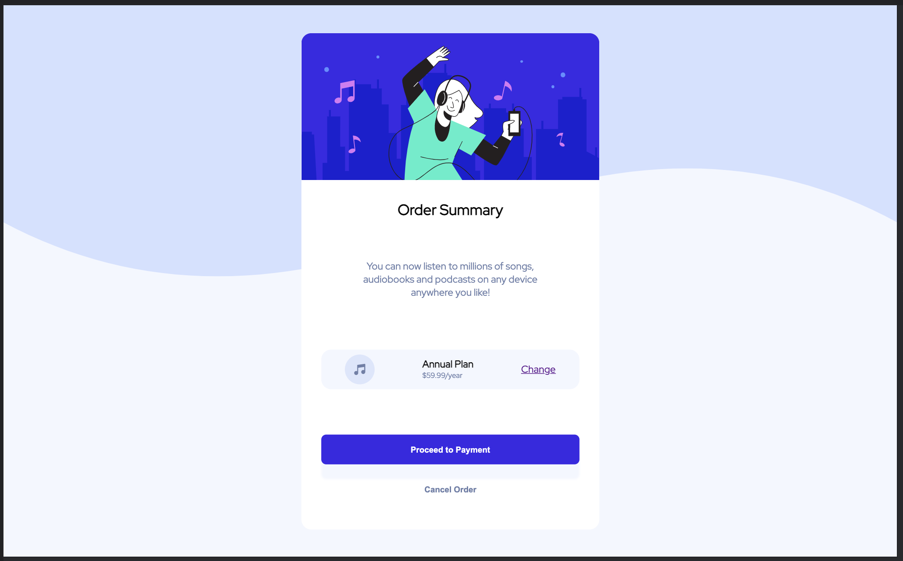
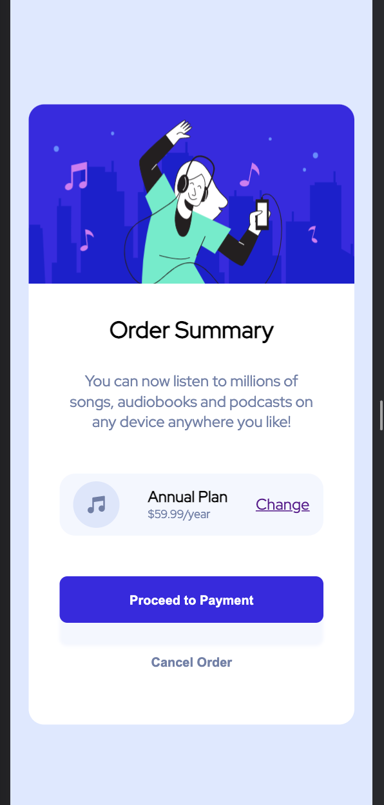

# Frontend Mentor - Order summary card solution

This is a solution to the [Order summary card challenge on Frontend Mentor](https://www.frontendmentor.io/challenges/order-summary-component-QlPmajDUj). Frontend Mentor challenges help you improve your coding skills by building realistic projects. 

## Table of contents

- [Overview](#overview)
  - [The challenge](#the-challenge)
  - [Screenshot](#screenshot)
  - [Links](#links)
- [My process](#my-process)
  - [Built with](#built-with)
  - [What I learned](#what-i-learned)
  - [Useful resources](#useful-resources)
- [Author](#author)
- [Available Scripts](#available-scripts)

## Overview

### The challenge

Users should be able to:

- See hover states for interactive elements

### Screenshot

Desktop

Mobile

### Links

- Solution URL: [repo](https://github.com/vhetet/frontend-mentor-challenge-order-summary-card)
- Live Site URL: [live demo](https://vhetet.github.io/frontend-mentor-challenge-order-summary-card/)

## My process

### Built with

- Semantic HTML5 markup
- Flexbox
- [React](https://reactjs.org/) - JS library

### What I learned

* How to us GitHub pages
* HSL colors

Beside that not much, I was just trying to get familiarize with the frontend mentor challenges.

### Useful resources

- [w3 school](https://www.w3schools.com/css/css3_mediaqueries.asp) - For whatever CSS I could not remember.
- [mozilla web docs](https://developer.mozilla.org/en-US/docs/Web/CSS/box-shadow) - Same reason

## Author

- Frontend Mentor - [@vhetet](https://www.frontendmentor.io/profile/vhetet)

## Available Scripts

In the project directory, you can run:

### `npm start`

Runs the app in the development mode.\
Open [http://localhost:3000](http://localhost:3000) to view it in the browser.

The page will reload if you make edits.\
You will also see any lint errors in the console.

### `npm test`

Launches the test runner in the interactive watch mode.\
See the section about [running tests](https://facebook.github.io/create-react-app/docs/running-tests) for more information.

### `npm run deploy`

Use gh-pages to deploy the app to the github page

